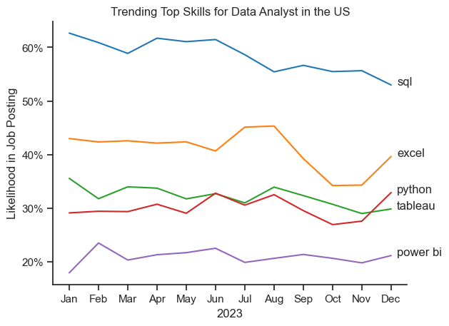
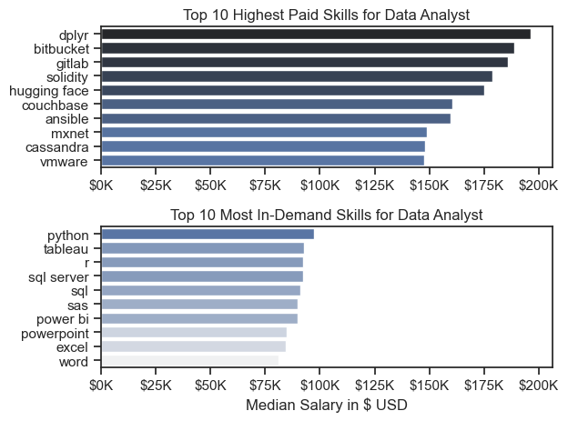

# Overview

I’m on my journey to becoming a Data Analyst, and this portfolio shows the projects and exercises I’ve worked on to build my skills with Python and data.

I took the course "Python for Data Analytics - Full Course for Beginners" because I wanted a strong, practical foundation in Python for data work. It helped me understand how to clean, analyze, and visualize real datasets — skills that are essential for any data analyst.


# Tools used

* Python: The main programming language I used throughout the projects for data manipulation and analysis.

* Pandas: For cleaning, transforming, and exploring datasets — helping me handle data efficiently.

* Matplotlib: To create clear and insightful visualizations that help tell the story behind the data.

* Jupyter Notebooks: My interactive workspace to write code, document my process, and test ideas step-by-step.

# The Questions

Below are the question I wanted to answer for this project based on a DataBase with more than 500k roles around the world from year 2023

1. What are the skills most in demand for the top 3 most popular data roles?

2. How are in-demand skills trending for Data Analysts?

3. How well do jobs and skills pay for Data Analysts?

# The Analysis

## 1. What are The Most Top 3 skills on demand for The Top 3 Most popular jobs


View my notebook here:
[02_Skills_Counting.ipynb](
03_Project\02_Skills_Counting.ipynb)

## Visualize Data

```python

df_skills_count = df_skills_count.reset_index(name='skill_count')

df_skills_count

job_titles = df_skills_count['job_title_short'].unique().tolist()

job_titles = sorted(job_titles[:3])

job_titles

fig, ax = plt.subplots(len(job_titles), 1)

sns.set_theme(style='ticks')

for i, job_title in enumerate(job_titles):
    df_plot = df_skill_percentage[df_skill_percentage['job_title_short'] == job_title].head(5)
    #df_plot.plot(kind='barh', x='job_skills', y='skill_percentage', ax=ax[i], title=job_title)
    sns.barplot(data=df_plot, x='skill_percentage', y='job_skills', ax=ax[i], hue='skill_count', palette='dark:b_r')
    ax[i].set_title(job_title)
    ax[i].set_ylabel('')
    ax[i].set_xlabel('')
    ax[i].get_legend().remove()
    ax[i].set_xlim(0, 82)

    for n, v in enumerate(df_plot['skill_percentage']):
        ax[i].text(v+1, n, f'{v:.1f}%', va='center')

    if i != len(job_titles) - 1:
        ax[i].set_xticks([])

#plt.tight_layout()
fig.suptitle('Likelihood of Skills Requested in US Job Postings', fontsize=15)
plt.tight_layout(h_pad=0.5)
plt.show()
```

### Results


# The Analysis
## 2. How are in-demand skills trending for Data Analyst through the year 2023?

### Visualization Data

``` python
# Importing Libraries
import ast
import pandas as pd
from datasets import load_dataset
import matplotlib.pyplot as plt
import seaborn as sns

#! pip install adjustText
#from adjustText import adjust_text


# loading data
dataset = load_dataset("lukebarousse/data_jobs")
df = dataset['train'].to_pandas()

# Data cleaning
df['job_posted_date'] = pd.to_datetime(df['job_posted_date'])
df['job_skills'] = df['job_skills'].apply(lambda x: ast.literal_eval(x) if pd.notna(x) else x)

df_DA_US_pivot.loc['Total'] = df_DA_US_pivot.sum()

df_DA_US_pivot = df_DA_US_pivot[df_DA_US_pivot.loc['Total'].sort_values(ascending=False).index]

df_DA_US_pivot = df_DA_US_pivot.drop('Total')

df_DA_US_pivot


df_plot = df_DA_US_percentage.iloc[:, :5]

sns.lineplot(data=df_plot, dashes=False, palette='tab10')
sns.set_theme(style='ticks')
sns.despine()

plt.title('Trending Top Skills for Data Analyst in the US')
plt.ylabel('Likelihood in Job Posting')
plt.xlabel('2023')
plt.legend().remove()


from matplotlib.ticker import FuncFormatter
ax = plt.gca()
ax.yaxis.set_major_formatter(FuncFormatter(lambda y, _: f'{y:.0f}%'))

for i in range(5):
    plt.text(11.2, df_plot.iloc[-1, i], df_plot.columns[i])

```

## Results




# The Analysis

## 3. How well do jobs and skills pay for Data Analyst based on 2023?

### Salary Analysis

``` python
sns.boxplot(data= df_US_top6, x='salary_year_avg', y='job_title_short', order=job_ordered)
sns.set_theme(style='ticks')

plt.title('Salary Distribution in the United States')
plt.xlabel('Yearly Salary in USD')
plt.ylabel('')
ax = plt.gca()
ax.xaxis.set_major_formatter(plt.FuncFormatter(lambda x, pos: f'${int (x/1000)}K'))
plt.xlim(0,600_000)

plt.show()

```
## Result


# Highest Paid vs. Most Demmanded Skills for Data Analysts

```python
df_DA_top_pay = df_DA_US.groupby('job_skills')['salary_year_avg'].agg(['count', 'median']).sort_values(by='median', ascending=False)

df_DA_top_pay = df_DA_top_pay.head(10)

df_DA_top_pay

df_DA_skills = df_DA_US.groupby('job_skills')['salary_year_avg'].agg(['count', 'median']).sort_values(by='count', ascending=False)

df_DA_skills = df_DA_skills.head(10).sort_values(by='median', ascending=False)

df_DA_skills

fig, ax = plt.subplots(2,1)

sns.set_theme(style='ticks')

# Top pay Skills
sns.barplot(data=df_DA_top_pay, x='median', y=df_DA_top_pay.index, ax=ax[0], hue='median', palette='dark:b_r')
ax[0].legend().remove()

#df_Da_top_pay[::-1].plot(kind='barh', y='median', ax=ax[0], legend=False)
ax[0].set_title('Top 10 Highest Paid Skills for Data Analyst')
ax[0].set_ylabel('')
ax[0].set_xlabel('')
ax[0].xaxis.set_major_formatter(plt.FuncFormatter(lambda x, pos: f'${int (x/1000)}K'))


#Top demanded skills
sns.barplot(data=df_DA_skills, x='median', y=df_DA_skills.index, ax=ax[1], hue='median', palette='light:b')
ax[1].legend().remove()


#df_Da_skills[::-1].plot(kind='barh', y='median', ax=ax[1], legend=False)
ax[1].set_xlim(ax[0].get_xlim())
ax[1].set_title('Top 10 Most In-Demand Skills for Data Analyst')
ax[1].set_ylabel('')
ax[1].set_xlabel('Median Salary in $ USD')
ax[1].xaxis.set_major_formatter(plt.FuncFormatter(lambda x, pos: f'${int (x/1000)}K'))

fig.tight_layout()


```

## Results




# Conclusions

The learning process has presented its challenges, including troubleshooting code errors and managing compatibility issues across Python versions. However, overcoming these obstacles has strengthened my problem-solving skills and deepened my understanding of data analysis.

I am confident that the knowledge and experience gained through this course and projects will serve as a solid foundation as I continue my development as a Data Analyst.